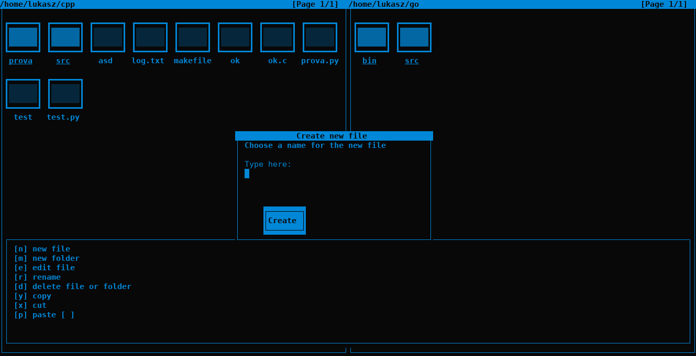

# ssfm

ssfm is a simple file-manager created to simplify operations involving files from the terminal. 
This can be particularly useful when using SSH connections and you only have the command line available.



### Installation

To install the program, you can proceed from pip:

```bash
pip3 install ssfm 
```

or clone and install from this repository manually.


### Documentation

The project is mainly inspired by SpaceVim, a terminal editor where operations are done with the spacebar 
key as leader. Below is a simplified version of the documentation with the main key combinations.

##### File operations 

+ ```<SPC><f><n>```: Create a new file
+ ```<SPC><f><m>```: Create a new folder
+ ```<SPC><f><e>```: Edit a file (or open the folder as project and edit)
+ ```<SPC><f><d>```: Delete a file or folder 
+ ```<SPC><f><y>```: Copy a file or folder 
+ ```<SPC><f><x>```: Cut a file or folder 
+ ```<SPC><f><p>```: Paste a file or folder 


##### Window operations 

+ ```<SPC><w><w>```: Switch focus to next window 
+ ```<SPC><w><n>```: Create a new window 
+ ```<SPC><w><d>```: Delete the currently focused window  

Note: deleting the last remaining window will lead to the termination of the application.


##### Git operations 

In order to use the git functionalities, it is actually required to install tig 
(https://github.com/jonas/tig).

+ ```<SPC><g><g>```: Summary of the status of the current git folder 
+ ```<SPC><g><s>```: Status - tig status command 
+ ```<SPC><g><l>```: Log - tig log command 


### Acknowledgements

For the realization of some window boxes, I used the library cursesDialog (https://github.com/jacklam718/cursesDialog)


